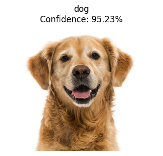
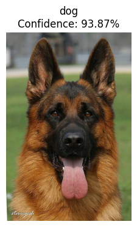
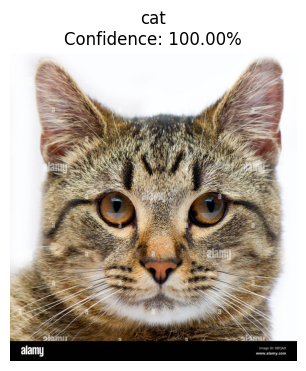
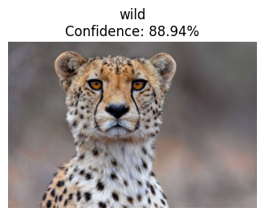

# Animal Classification CNN 🐱🐶🐆

A deep learning project that classifies images into three categories: cats, dogs, and wild animals using a custom Convolutional Neural Network (CNN) built with PyTorch.

## 📊 Model Performance

The model achieved exceptional performance with a **99% validation accuracy** at epoch 15.

### Training Results

| Metric | Value |
|--------|-------|
| Best Validation Accuracy | 99.00% |
| Final Training Loss | 0.0312 |
| Best Model Epoch | 15 |
| Total Epochs | 18 |

### Classification Report

```
              precision    recall  f1-score   support

         cat       1.00      0.99      0.99       500
         dog       0.99      0.99      0.99       500
        wild       0.98      1.00      0.99       500

    accuracy                           0.99      1500
   macro avg       0.99      0.99      0.99      1500
weighted avg       0.99      0.99      0.99      1500
```

## 🏗️ Model Architecture

```
Total Parameters: 26,080,579
Trainable Parameters: 26,080,579
Model Size: ~99.49 MB
```

### Network Structure

- **Conv Layer 1**: 32 filters (3×3) → MaxPool
- **Conv Layer 2**: 64 filters (3×3) → MaxPool
- **Conv Layer 3**: 128 filters (3×3) → MaxPool
- **Conv Layer 4**: 256 filters (3×3) → MaxPool
- **Fully Connected 1**: 512 units with Dropout
- **Output Layer**: 3 classes (Softmax)

**Input Size**: 224×224 RGB images  
**Estimated Total Size**: 128.78 MB

## 📈 Training Progress

| Epoch | Training Loss | Validation Accuracy | Best Model |
|-------|---------------|---------------------|------------|
| 1 | 0.3965 | 94.33% | ✅ |
| 2 | 0.1314 | 96.40% | ✅ |
| 3 | 0.0932 | 97.87% | ✅ |
| 6 | 0.0525 | 98.47% | ✅ |
| 9 | 0.0384 | 98.60% | ✅ |
| 15 | 0.0314 | **99.00%** | ✅ |
| 18 | 0.0312 | 98.33% | |

## 🖼️ Sample Predictions

### Confusion Matrix


### Test Results






```

## 🎯 Features

- Custom CNN architecture optimized for animal classification
- Data augmentation for improved generalization
- Dropout regularization to prevent overfitting
- Comprehensive evaluation metrics and visualizations
- Model checkpointing to save best performing weights

## 📝 Dataset

The model is trained on three classes:
- **Cat**: Domestic cats
- **Dog**: Domestic dogs  
- **Wild**: Wild animals (including big cats like cheetahs, leopards, etc.)

Each class contains 500 test samples for evaluation.

## 🔧 Hyperparameters

- **Optimizer**: Adam
- **Learning Rate**: Default (0.001)
- **Batch Size**: Variable
- **Image Size**: 224×224 pixels
- **Dropout Rate**: Applied in fully connected layers

## 📊 Results Analysis

The model demonstrates excellent performance across all classes:
- **Cats**: 100% precision, 99% recall
- **Dogs**: 99% precision, 99% recall  
- **Wild Animals**: 98% precision, 100% recall

The confusion matrix shows minimal misclassifications, indicating robust feature learning.

